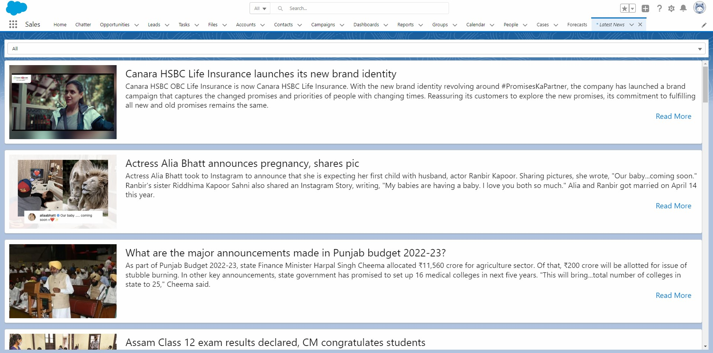
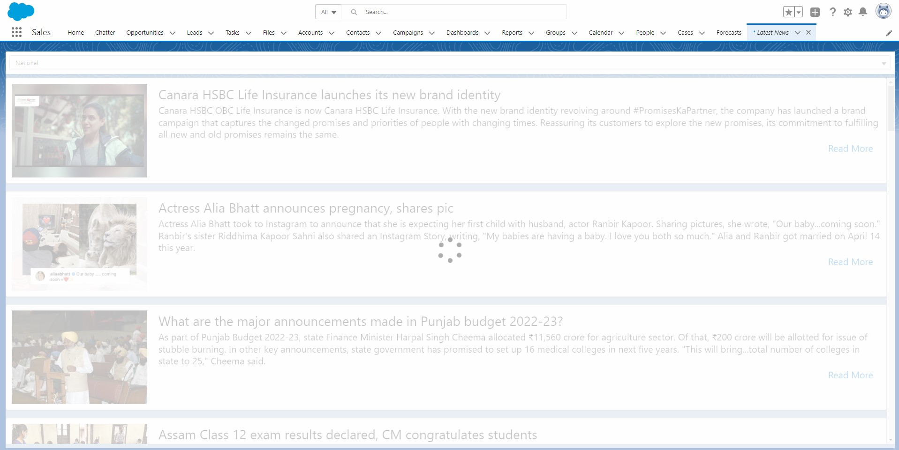
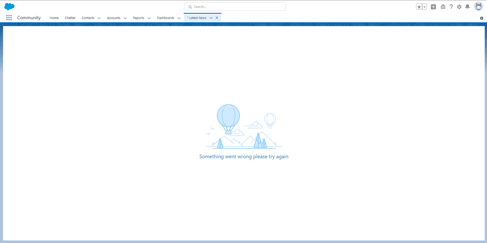

# Latest News LWC

This repository contains Salesforce SFDX based project to get the latest news. Lightning Web Components is used to achieve visualization of data and images. Data is fetched using [Inshorts News API [Unofficial]](https://github.com/cyberboysumanjay/Inshorts-News-API)

# Glance

# Note
Custom Metadata has been used to show all news category's available in component.
We can add or remove category's in custom Metadata.(Currently we have added all category's in custom metadata those supported by [Inshorts News API [Unofficial]](https://github.com/cyberboysumanjay/Inshorts-News-API)).

# Built With
* Lightning Web Components - Salesforce based web framework
* Apex
* Custom Metadata
